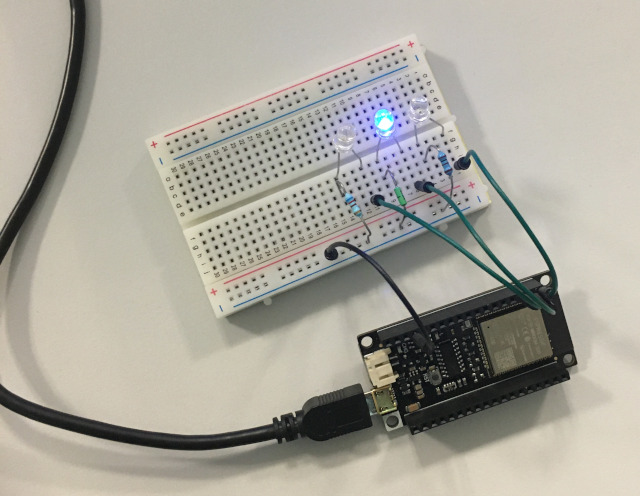

# MicroPython on ESP32/ESP8266 microcontollers

The repository contains MicroPython lab exercises for [*Digital Electronics*](https://www.vut.cz/en/students/courses/detail/268609) course at Brno University of Technology, Czechia.

   

## Exercises

1. [Tools for programming and debugging ESP32 microcontrollers](labs/01-tools)
2. [Programming in Python, Git version-control system](labs/02-python)
3. [Control of GPIO pins](labs/03-gpio)
4. [Timers](labs/04-timers)
5. [LCD (Liquid Crystal Display)](labs/05-display)
6. [I2C serial communication](labs/06-serial)
7. Wi-Fi communication
8. ADC

## List of examples

* [Blink](examples/01-blink/main.py)
* [Timer blink](examples/02-timers/main.py)
* [Wi-Fi scan](examples/03-wifi-scan/main.py)
* [Wi-Fi connection](examples/04-wifi-connection/main.py)
* [I2C humidity & temperature sensor](examples/05-i2c-sensor/main.py)
* [I2C sensor & ThingSpeak](examples/06-i2c-sensor-thingspeak/main.py)
* [RTC & NTP times](examples/07-rtc/main.py)
* [Wi-Fi access point](examples/08-access-point/boot.py)
* [Web server & I2C sensor](examples/09-web-server-i2c-sensor/)
* [Jupyter example](examples/99-jupyter/test_micropython.ipynb)

## Components

The following hardware and software components are mainly used in the lab.

| **Component** | **Links** |
| :-- | :-- |
| ESP32 microcontroler | [Expressif](https://www.espressif.com/en/products/socs/esp32) |
| FireBeetle board | [Schematic](docs/firebeetle_esp32_board_user_manual.pdf) & manual, [pinout](labs/03-gpio/images/DFR0478_pinout.png)
| DHT12 | I2C humidity and temperature sensor: [data sheet](docs/dht12_manual.pdf) |
| MPU6050 | I2C gyroscope and accelerometer: [data sheet](docs/dht12_manual.pdf) |
| DS3231 | I2C real time clock: [data sheet](docs/ds3231_manual.pdf) |
| HC-SR04 | ultrasonic sensor: [datasheet](https://components101.com/ultrasonic-sensor-working-pinout-datasheet) |
| Joystick PS2 | Analog [joystick PS2](https://arduino-shop.cz/arduino/884-arduino-joystick-ps2.html)
| Logic analyzer | 24MHz 8-channel [logic analyzer](https://www.ebay.com/sch/i.html?LH_CAds=&_ex_kw=&_fpos=&_fspt=1&_mPrRngCbx=1&_nkw=24mhz%20logic%20analyzer&_sacat=&_sadis=&_sop=12&_udhi=&_udlo=): [software](https://www.saleae.com/)
| Osciloscope DSOX3034T | Oscilloscope Keysight Technologies [DSOX3034T](https://www.keysight.com/en/pdx-x202175-pn-DSOX3034T/oscilloscope-350-mhz-4-analog-channels?&cc=CZ&lc=eng) (350 MHz, 4 analog channels), including 16 logic timing channels [DSOXT3MSO](https://www.keysight.com/en/pdx-x205238-pn-DSOXT3MSO/3000t-x-series-oscilloscope-mso-upgrade?cc=CZ&lc=eng) and serial protocol triggering and decode options [D3000BDLA](https://www.keysight.com/en/pd-2990560-pn-D3000BDLA/ultimate-software-bundle-for-the-3000a-t-x-series?&cc=CZ&lc=eng) |
| Thonny IDE | [Python IDE for beginners](https://thonny.org/) |
| Mu editor | [Python editor](https://codewith.mu/) |
| VS Code | [Visual Studio Code](https://code.visualstudio.com/) |
| Git | [git](https://git-scm.com/) |

## References

1. [Installation of MicroPython on ESP32 and ESP8266](https://github.com/tomas-fryza/esp-micropython/wiki/Installation-of-MicroPython-on-ESP32-and-ESP8266)

2. [IDEs for MicroPython](https://github.com/tomas-fryza/esp-micropython/wiki/IDEs-for-MicroPython)

3. [ESP32 brief overview](https://www.youtube.com/watch?v=DoctWoxIaH8) (YouTube video)

4. [Getting started with MicroPython on the ESP32](https://docs.micropython.org/en/latest/esp32/tutorial/intro.html)

5. [Video tutorial about ESP32 MicroPython](https://www.youtube.com/playlist?list=PLw0SimokefZ3uWQoRsyf-gKNSs4Td-0k6)

6. MicroPython Documentation. [Quick reference for the ESP32](https://docs.micropython.org/en/latest/esp32/quickref.html)

7. DFRobot. [250+ Must-read Tutorials for Learning ESP32 and Arduino](https://www.dfrobot.com/blog-1578.html)

8. [40+ MicroPython Projects, Tutorial and Guides with ESP32 / ESP8266](https://randomnerdtutorials.com/projects-esp32-esp8266-micropython/)
