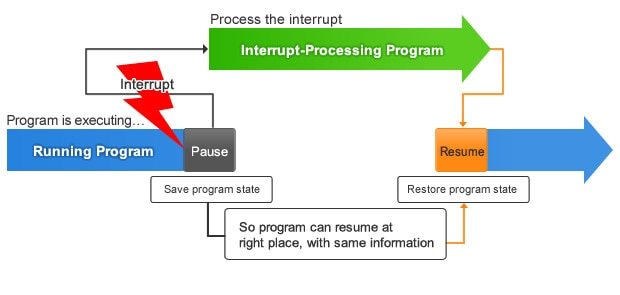
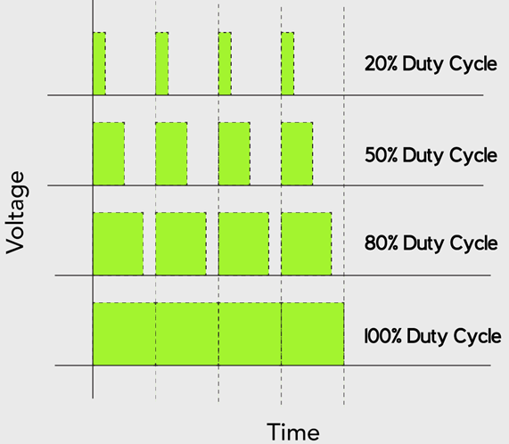
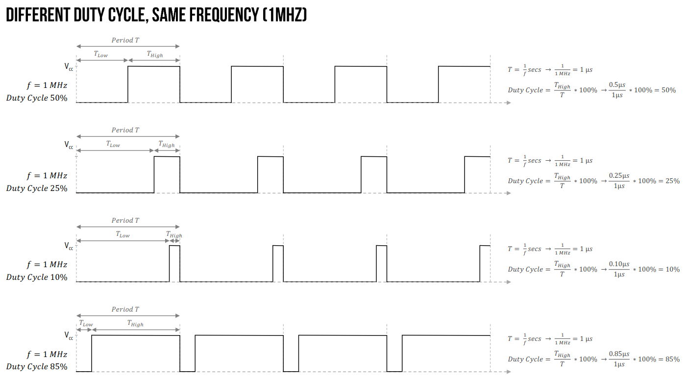

# Lab 4: Timers

### Learning objectives

After completing this lab you will be able to:

* Use internal microcontroller timers
* Understand overflow and PWM
* Combine different interrupts in MicroPython

The purpose of this laboratory exercise is to acquire the skills to interact with timers and interrupts of the ESP32 microcontroller.

### Table of contents

* [Pre-Lab preparation](#preparation)
* [Part 1: Interrupts](#part1)
* [Part 2: ESP32 timer overflows](#part2)
* [Part 3: PWM and LED dimming](#part3)
* [(Optional) Experiments on your own](#experiments)
* [References](#references)

### Components list

* ESP32 board, USB cable
* Breadboard
* 2 LEDs, 2 resistors
* Jumper wires

<a name="preparation"></a>

## Pre-Lab preparation

1. Remind yourself how to write and run functions in MicroPython.

<a name="part1"></a>

## Part 1: Interrupts

Interrupts can be triggered by both internal and external devices within the microcontroller unit (MCU). It represents a signal **Interrupt request** sent to the processor by hardware or software, signifying an event that requires immediate attention. When an interrupt is triggered, the controller finishes executing the current instruction and proceeds to execute an **Interrupt Service Routine (ISR)** or Interrupt Handler. ISR tells the processor or controller what to do when the [interrupt occurs](https://www.tutorialspoint.com/embedded_systems/es_interrupts.htm). After the interrupt code is executed, the program continues exactly where it left off.



Interrupts can be set up for events such as a counter's value, a pin changing state, receiving data through serial communication, or when the Analog-to-Digital Converter has completed the conversion process.

<a name="part2"></a>

## Part 2: ESP32 timer overflows

A timer (or counter) is an integral hardware component in a microcontroller unit designed for measuring time-based events. Timers count from 0 to (2^n -1), where `n` being the number of bits of the counter. Thus, an 8-bit counter will count from 0 to 255, a 16-bit counter will count from 0 to 65535, and so on.

ESP32 has two timer groups, each group containing two 64-bit timers. Thus, there are four 64-bit timers in total, designated as Timer0, Timer1, and Timer2. They are all 64-bit generic timers based on 16-bit prescalers and 64-bit up/down counters which are capable of being auto-reloaded.


Prescalers help divide the base clock frequency. ESP32 generally has a base clock frequency of 80 MHz and it can be a bit too high. Having a 16-bit pre-scaler means that you can divide the base clock frequency by at least 2 and by as much as 65536. 80 MHz/65535 = 1.22 KHz. Now, this means that the frequency of a timer can be adjusted from 1.22 KHz to 80 MHz (of course in discrete steps). This wide range of frequency, along with the fact that these are 64-bit timers ensures that almost any interval is possible with ESP32 timers.

The timer interrupts are the best way to run non-blocking functions at a certain interval. For that, we can configure and attach a particular timer interrupt to a specific Interrupt Service Routine or ISR.

The MicroPython's `machine.Timer` class defines a baseline operation of initializing and executing a callback with a given period or once after some delay.

   ```python
   from machine import Timer
   tim = Timer(0)  # Timer0

   def mycallback(t):
       pass

   # Periodic at 1kHz
   tim.init(freq=1000, mode=Timer.PERIODIC, callback=mycallback)

   # Periodic with 100ms period
   tim.init(period=100, callback=mycallback)

   # One shot firing after 1000ms
   tim.init(period=1000, mode=Timer.ONE_SHOT, callback=mycallback)
   ```

The init keyword arguments are:

* `freq` is the timer frequency, in units of Hz
* `period` is the timer period in milliseconds
* `mode` can be `Timer.ONE_SHOT` or `Timer.PERIODIC`
* `callback` is executed whenever a timer is triggered. The callback must take one argument, which is passed the Timer object.

> **NOTE:** In MicroPython, the timer parameter of the `mycallback` function is a reference to the timer object that triggered the interrupt. This parameter allows you to identify which timer initiated the interrupt if your code works with multiple timers.

To blink the on-board LED with a period of 1 sec, use the following code:

   ```python
   from machine import Pin, Timer

   def timer0_handler(t):
       """Interrupt handler of Timer0"""
       led0.value(not led0.value())


   # Create an object for on-board LED
   led0 = Pin(2, mode=Pin.OUT)
   timer0 = Timer(0)  # Between 0-3 for ESP32
   timer0.init(period=1000, mode=Timer.PERIODIC, callback=timer0_handler)
   ```

1. Utilize a breadboard and jumper wires to connect two additional LEDs and resistors to GPIO pins 25 and 26 on the ESP32 in an active-high configuration.

   

2. Create a new source file, save it as `01-blink_leds.py` in your local folder, and write the code to continuously blink all three LEDs (onboard + external).

   ```python
   from machine import Pin, Timer

   # Define three LED pins
   led0 = Pin(2, Pin.OUT)
   timer0 = Timer(0)
   timer0.init(period=100, mode=Timer.PERIODIC, callback=timer0_handler)

   # COMPLETE THE CODE

   ```

3. (Optional) Creating a time domain using the main timer interrupt of an ESP32 in MicroPython is a powerful way to precisely control timing for various tasks or applications. Use a global variable to identify time intervals and increment a time variable within a timer interrupt of an ESP32 in MicroPython. You can access this variable from both the timer interrupt and the main loop to perform tasks based on the elapsed time.

   ```python
   from machine import Timer

   # Define global variables
   time_variable = 0

   # Define the timer callback function
   def timer_callback(t):
       global time_variable  # Access the global time_variable
       time_variable += 1

   # Initialize and configure the timer
   main_timer = Timer(0)  # Use Timer 0
   main_timer.init(period=100, mode=machine.Timer.PERIODIC, callback=timer_callback)

   try:
       while True:
           # Your main program logic can run here
           # You can access the time_variable to check elapsed time.
           pass
   except KeyboardInterrupt:
       # Deinitialize the timer before exiting
       main_timer.deinit()
   ```

<a name="part3"></a>

## Part 3: PWM and LED dimming

**Pulse Width Modulation** (PWM) changes the average power delivered from a signal by chopping the square wave signal into discrete parts. It is not an actual continuous signal. Instead, a periodic digital signal's ON, and OFF duration is modulated to reduce the effective voltage/power output. For example, if a microcontroller's GPIO outputs 3.3V in digital output while generating a PWM signal of [50% duty cycle](https://makeabilitylab.github.io/physcomp/esp32/led-fade.html) from the pin, it will output an effective voltage of approximately 1.65V, i.e., 3.3/2.

   

   

The PWM class is written to provide pulse width modulation in MicroPython supported boards. This class can be imported into a MicroPython script using the following statements. After importing, an object has to be instantiated from the PWM class.

   ```python
   from machine import PWM
   pwm_object = PWM(pin, freq=frequency, duty=duty_cycle)
   ```

1. Create a new source file, save it as `03-pwm.py` in your local folder, and write the code to change a duty cycles of onboard LED (`Pin(2)`) within a `for` cycle from 0 to 1024 (10-bit resolution) in forever loop. To deinitialize PWM object, use `deinit()` method.

   ```python
   ...
   try:
       while True:
           for duty in range(0, 1024, 5):  # 0, 5, 10, ..., 1020, 0, ...
               # Pulse width resolution is 10-bit only !
               led_with_pwm.duty(duty)
               time.sleep_ms(10)

   except KeyboardInterrupt:
       print("Ctrl+C Pressed. Exiting...")
   finally:
       # Optional cleanup code
       led_with_pwm.deinit()  # Deinitialized the PWM object
   ```

2. Combine both examples and modify the duty cycle of one LED within the Timer0 interrupt handler instead of the main loop. This approach allows you to independently control the duty cycles of multiple PWM signals.

Program a *Breathing light* application. It is a visual effect where the intensity or brightness of an LED, smoothly and periodically increases and decreases in a manner that resembles the rhythm of human breathing. This effect is often used in various electronic and lighting applications to create visually appealing and calming effects.

<a name="experiments"></a>

## (Optional) Experiments on your own

1. To combine timers and PWM in MicroPython on an ESP32, create a smooth fading effect using an RGB LED or two-colour LED. By controlling the intensity of the red, green, and blue components, you can achieve various colors and dynamic color transitions. Timers will be used to control the PWM signals for each color component.

<a name="references"></a>

## References

1. MicroPython documentation. [class Timer -- control hardware timers](https://docs.micropython.org/en/latest/library/machine.Timer.html)

2. Physical Computing. [Lesson 3: Fading an LED with PWM](https://makeabilitylab.github.io/physcomp/esp32/led-fade.html)

3. Nikhil Agnihotri. [MicroPython -- Generating PWM on ESP8266 and ESP32](https://www.engineersgarage.com/micropython-esp8266-esp32-pwm-led-fading/)

4. MicroPython documentation. [class PWM -- pulse width modulation](https://docs.micropython.org/en/latest/library/machine.PWM.html)
